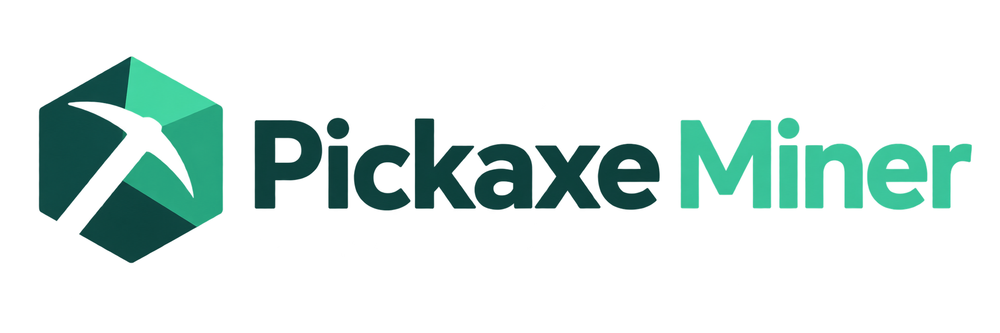

# Pickaxe Miner



Rust-first, GPU-only miner for the PHOTON CashToken on Bitcoin Cash.

## Scope

PHOTON work is the live covenant and CashToken baton: the baton outpoint, NFT commitment, token amount, and PHOTON target. BCH `getblocktemplate` and `getblocktemplatelight` are not a mining job source.

Fulcrum/Electrum discovers the indexed baton. Native node RPC is used for chain validation and raw transaction broadcast.

## Supported platforms

- Operating systems: Windows x86_64 and Linux x86_64
- NVIDIA: CUDA PTX `sm_120`
- AMD: HIP `gfx1036`
- No ARM, ARM64, or macOS build

## Install a release archive

The prepared v0.0.1 archives are:

- Linux: `pickaxe-miner-v0.0.1-linux-x86_64.tar.gz`
- Windows: `pickaxe-miner-v0.0.1-windows-x86_64.zip`

The [v0.0.1 release](https://github.com/CyberAshven/pickaxe-miner/releases/tag/pickaxe-miner-v0.0.1) publishes these archives and `SHA256SUMS.txt`. Release binaries enable the tested CUDA incremental search and tuned batch geometry. HIP retains its existing search path.

Merging to `master` runs the Release workflow, which tags the merged commit `pickaxe-miner-v<Cargo.toml version>` and publishes these archives. A merge that does not bump the version publishes nothing, and a push that only changes Markdown files or `docs/` never starts a release. Pull requests affecting release packaging run it as a dry run. Manual dispatch rebuilds an existing tag.

Linux:

```bash
tar -xzf pickaxe-miner-v0.0.1-linux-x86_64.tar.gz
cd pickaxe-miner-v0.0.1-linux-x86_64
./pickaxe mine
```

Windows PowerShell:

```powershell
Expand-Archive pickaxe-miner-v0.0.1-windows-x86_64.zip -DestinationPath pickaxe-miner-v0.0.1-windows-x86_64
cd pickaxe-miner-v0.0.1-windows-x86_64
.\pickaxe.exe mine
```

Headless, from the same directory:

```bash
./pickaxe mine --no-tui
```

```powershell
.\pickaxe.exe mine --no-tui
```

## Build

```bash
cargo build --release --locked --features incremental-k
```

The cargo binary is `target/release/pickaxe_miner` (`pickaxe_miner.exe` on Windows). `--version` prints `pickaxe 0.0.1`.

Keep the bundled `cuda/build` directory beside the executable when distributing it. Omitting `--features incremental-k` builds the original CUDA search path.

Interactive TUI:

```bash
cargo run --release --features incremental-k -- mine
```

Headless:

```bash
cargo run --release --features incremental-k -- mine --no-tui
```

List GPUs:

```bash
cargo run --release -- devices
```

Benchmark:

```bash
cargo run --release -- benchmark
```

## Limitations

- There is no CPU mining fallback.
- `wgpu` is not a verified production backend. Production mining is CUDA or HIP.
- The donation is hard-coded at 2%.
- CUDA performance was measured on the local NVIDIA GPU; HIP artifacts are build-verified, without a physical AMD performance claim.

## Features

- High-performance native GPU mining
- Live PHOTON CashToken baton discovery
- Automatic winner verification and submission
- Runtime intensity control from 10% to 100%
- Safe live payout-address switching
- Fulcrum/Electrum connectivity
- Native BCH node validation and transaction broadcast
- Interactive Ratatui interface
- Headless and JSON operation
- Persistent, bounded GPU memory architecture
- Stale-job and generation protection
- Device discovery and benchmark tools

The `reference/` directory contains PHOTON reference material used for implementation and correctness testing.
