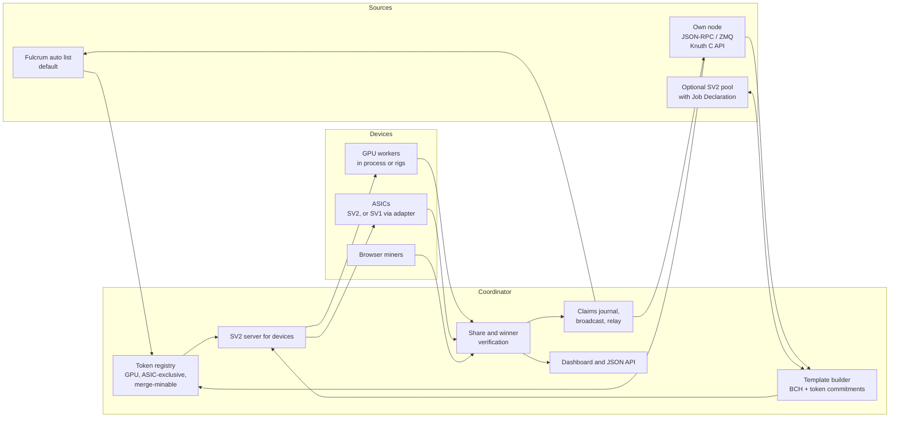

# Architecture and research

Where Pickaxe is going beyond the GPU miner, how the parts fit together, and
what already exists in the Bitcoin Cash mining ecosystem. The decided order is
in [next-steps.md](next-steps.md); the BCH Stratum V2 server from step 1 is
documented in [stratum-v2.md](stratum-v2.md), with its evidence in
[implementation-status.md](implementation-status.md). Research dates are the
day each fact was checked.

## What Pickaxe ships today

- GPU engines: CUDA for NVIDIA, native HIP for AMD Radeon RX 6000, 7000 and
  9000, and the portable wgpu engine (Vulkan, optional DirectX 12, Metal and
  the browser miner's WebGPU). See [gpu-sources.md](gpu-sources.md).
- Every GPU of a machine mines in one process: one job, one claim path, a job
  mailbox and restart with backoff per GPU, so a stuck GPU never blocks the
  others.
- PHOTON, the covenant token GPUs grind: jobs come from the automatic Fulcrum
  server list or the miner's own servers; claims are journaled, broadcast
  first and relayed to further servers; successor-baton mining keeps the GPUs
  busy between claims.
- Own node: BCHN-style JSON-RPC with failover between configured nodes,
  `getblocktemplatelight` with classic `getblocktemplate` as fallback,
  `submitblock` and `sendrawtransaction`. Servers and nodes are saved once per
  network.
- BCH ASIC mining (step 1, PR #38): a Stratum V2 server on the reference Rust
  crates, an SV1 adapter for SV1 firmware, full templates from the miner's
  BCHN node, a durable block journal, per-device vardiff, a workers table with
  each device's own report, and an adjustable donation. Tested on Chipnet with
  an Avalon Nano 3.

## Product direction

- Solo miners first: one person's devices, from one machine to farms of many
  machines, mine as one and never compete with each other.
- GPU mode mines covenant tokens that GPUs grind (PHOTON today), natively and
  in the browser.
- ASIC mode offers two choices: an ASIC-exclusive token (SAFA-style), or BCH
  plus every merge-minable SHA-256 token at once.
- Where hashes go:
  - P2Pool is a first-class destination and the intended default: pooled
    payouts without a pool operator.
  - Stratum V2 pools as a failover list, using the miner's own templates where
    a pool offers Job Declaration. The model is Gupax for Monero, which bundles
    P2Pool with the miner and keeps lists of nodes it pings, picks from and
    fails over between.
  - Solo on the miner's own node.
- Node connection: the automatic Fulcrum list stays the default, since many
  miners will not run a node; using one's own node becomes a guided step.
- Chipnet and mainnet are one code path with a network switch. Network
  differences live in data (deployments, ports, address prefixes, server
  lists); new work is tested on Chipnet first.

## Architecture

- One coordinator per miner is the only process that talks to the chain. It
  holds the payout addresses, journals and broadcasts claims and blocks, and
  serves the dashboard. Rigs and ASICs connect to it over Stratum V2 (Noise).
- Job sources: the Fulcrum list for covenant tokens (default), the miner's own
  node for block templates and broadcasts (required for BCH and merge mining
  unless a pool is used), and an optional pool.
- Devices get disjoint work without nonce bookkeeping: GPU workers sign with
  their own keys (covenant tokens); ASIC jobs get distinct extranonces or, for
  header-only jobs, distinct payout or commitment fields.

## Research findings

### Stratum V2

- Three sub-protocols: the Mining Protocol (device to upstream), Job
  Declaration (a miner declares its own template to a pool) and Template
  Distribution (a template provider, normally a node, to the job declarator).
  Binary and Noise-encrypted.
- Channels: standard (header-only; the upstream sends the merkle root),
  extended (the device builds the coinbase with an extranonce) and group
  channels. A translator lets SV1-only firmware join.
- Reference implementation (SRI, Rust): the protocol, codec, Noise and channel
  crates in `stratum-mining/stratum`, and the pool, job declarator and
  translator applications in `stratum-mining/sv2-apps`. Start9 packages SV2
  pool, solo and Job Declaration services for StartOS.

### Stratum V2 on BCH (checked 2026-10-05)

- bchn-sv2-bridge (LoneStrike Labs, AGPL-3.0, Python standard library only):
  an SV2 Template Distribution server for unmodified BCHN over JSON-RPC.
  BCH specifics: with canonical transaction order (CTOR) every refresh is a
  full template, never incremental; no segwit or witness commitment;
  templates sized to BCH's adaptive block size limit; a local proof-of-work
  check before `submitblock`. Tested on mainnet. Job Declaration is disabled
  on purpose: declaring jobs without canonical order produces invalid blocks.
- LoneStrike's BCH apps for Umbrel: SRI's pool patched for BCH (a zero vardiff
  floor and a tunable extranonce2), a Rust shim that terminates the pool's
  Noise link and forwards template frames to the bridge, BCHN, Fulcrum, and a
  BCH solo pool built on ASICseer pool.
- Knuth is adding Stratum V2 Template Distribution inside the node: framing,
  primitives, the template messages and connection setup were merged in July
  2026 (#534, #535, #537, #539, #540), on a mining job store moved out of the
  RPC layer (#532) and a configurable coinbase reserve (#530). Its JSON-RPC
  mining calls are `getblocktemplatelight`, `submitblocklight` and
  `getmininginfo`, backed by its C API. Interoperability with Pickaxe is not
  tested yet.
- ckpool supports Stratum V2 for pool and solo servers and for proxy
  upstreams, with a Job Declaration server; Bitcoin only. The BCH ckpool forks
  (ASICseer pool, EloPool) had not adopted it when checked.
- SoloFury (closed source) runs Stratum V2 for BCH solo mining: extended
  channels only, no Job Declaration, CashAddr identities and a target per
  block from ASERT.
- The official Stratum V2 UI app for Umbrel is a setup wizard and dashboard
  for pool, solo and Job Declaration mining with the user's own node, running
  SRI's translator for SV1 miners; Bitcoin only. It is a model for Pickaxe's
  setup screens.
- Bitaxe firmware (ESP-Miner) has a native Stratum V2 client.
- BCHN has no Stratum V2 merge requests or issues; it gets Stratum V2 through
  external bridges.

What this means for Pickaxe, and what step 1 did:

- Do not re-implement Stratum V2: Pickaxe uses the SRI Rust crates for Noise,
  framing, messages and vardiff, with its own BCH work on top.
- Template sources: Pickaxe's own JSON-RPC client for stock BCHN (full
  templates first; `getblocktemplatelight` next), then Knuth's in-node
  template provider or its C API.
- CTOR: full templates only, and any Job Declaration client must keep
  canonical transaction order.
- Merge mining needs coinbase room for token commitments; Template
  Distribution's coinbase output constraints declare it, and Knuth's coinbase
  reserve sizes it.
- Devices: Bitaxe speaks Stratum V2 natively; most other firmware speaks SV1
  and connects through Pickaxe's adapter.

### Non-custodial payouts

- sv2-spec PR #203 (open) proposes a coinbase payouts extension:
  `SetPayoutDistribution` and a distribution ID on declared jobs, for non-debt
  accounting (PPLNS, SLICE, TIDES); validation recomputes the expected coinbase
  outputs and rejects mismatches. It suits BCH, whose large blocks carry many
  coinbase outputs.

### BCH pools and P2Pool

- ASICseer pool: a multithreaded C ckpool fork for BCH with pool and solo
  modes, using BCHN's `getblocktemplatelight`.
- EloPool: a ckpool fork focused on BCH.
- P2Pool for BCH: jtoomim's P2Pool supports BCH (CashAddr, port 9348), and the
  BitcoinCash1 organization keeps `p2poolBCH`. Current BCH sharechain activity
  has not been checked.
- The BitcoinCash1 organization packages BCH infrastructure for StartOS:
  ASICseer pool, EloPool, Knuth, Flowee the Hub, bchd, Fulcrum and an explorer.

### Nodes and interfaces

- BCHN: JSON-RPC `getblocktemplate`, and `getblocktemplatelight` with
  `submitblocklight`, which are job-ID based: transaction data never reaches
  the miner and the node rebuilds the block.
- Knuth: a C++ node with a stable C API and bindings (C, C++, JavaScript and
  TypeScript, WebAssembly, C#, Python), usable in-process as a library, with
  optional JSON-RPC since 1.3.0. Supporting its native interface keeps Pickaxe
  from being limited to JSON-RPC.
- Flowee the Hub (binary API) and bchd (Go, gRPC) are further candidates.
- Local JSON-RPC is itself inter-process communication, so these notes name
  the interface (JSON-RPC, Knuth's C API, Cap'n Proto) rather than "IPC".

### ASIC-minable tokens on BCH

- SAFA (proposal, September 2026): a SHA-256 ASIC-minable token with an
  automated market. The ASIC hashes an 80-byte NFT commitment shaped like a
  block header: version (4), previous commitment hash (32), payout locking
  bytecode hash (32), timestamp (4), target (4) and nonce (4). A win is a
  HASH256 below the target, with
  `NextTarget = PrevTarget * (5000 * age / 71 + 5000) / 10000`. No deployment
  yet.
- Block Tops (BTOP): an earlier minable CashToken proposal.

### Merge mining tokens with BCH

- No BCH token merge mining exists yet. The precedent is AuxPoW (Namecoin with
  Bitcoin). For a covenant token it means verifying a BCH header and a
  coinbase merkle branch in script.

## ASIC mode design

### ASIC-exclusive token (SAFA-style)

- The coordinator builds 80-byte header-shaped jobs: the previous commitment
  hash in the previous-hash slot, the payout hash in the merkle-root slot,
  target and time.
- Standard (header-only) channels fit naturally: the upstream sends the merkle
  root and the device hashes the header as given.
- SV1 firmware builds the merkle root from a coinbase and extranonces, which
  cannot produce a fixed payout hash, so how SV1 ASICs would mine such a token
  is an open question.
- Claims are covenant transactions built by the coordinator, as for PHOTON.

### BCH plus every merge-minable token

- Templates come from the miner's own node, and the coinbase carries a
  commitment to every registered merge-minable token's current job.
- Each share is checked against the BCH target and every token's target: a BCH
  block goes to `submitblock`; a token-qualifying share becomes that token's
  claim transaction carrying the header, the coinbase and its merkle branch.
- This needs a merge-minable covenant standard designed with token authors,
  and a proof that it fits within BCH's VM limits, as
  `tools/reward-policy-vm` did for PHOTON's layouts.

## Own-node setup

- The automatic Fulcrum list stays the default: zero setup.
- "Use my own node" becomes a guided step: detect local nodes on standard
  ports, read cookie authentication from default data directories, test the
  connection, and show node name, version, network and sync height; warn when
  the node is behind or on the wrong network.
- When the node stops answering, keep mining from the Fulcrum list, show it on
  the dashboard, and switch back when the node returns.
- ASIC BCH and merge mining need a node (or a pool), and setup says so only in
  that mode.

## Phases

1. BCH Stratum V2, so a miner points their ASIC at Pickaxe. Implemented in
   PR #38: SV2 firmware connects directly and SV1 firmware through the adapter,
   templates come from the miner's BCHN node, and the dashboard lists every
   device. Remaining items are tracked in
   [implementation-status.md](implementation-status.md).
2. GPU scaling: a coordinator and rigs on many machines, one job pushed to
   every rig, one claim path and one dashboard (PR #32).
3. The gaps, in an order to agree later: ASIC-exclusive tokens, the
   merge-minable token standard and the BCH-plus-tokens mode, the guided
   own-node setup, the Stratum V2 pool connector with Job Declaration and
   coinbase payouts, and P2Pool.

## Open questions

- Whether Bitaxe's Stratum V2 client opens standard (header-only) channels,
  which SAFA-style tokens need.
- When to start the merge-minable covenant design with token authors, and
  whether SAFA could align with it.
- Knuth: its C API in-process, or its RPC from a separate process.
- Which pools to list once any supports Stratum V2 Job Declaration for BCH.

## Sources

- SRI: https://github.com/stratum-mining/stratum , https://github.com/stratum-mining/sv2-apps
- Stratum V2 specification: https://stratumprotocol.org/specification/03-protocol-overview/ ;
  Job Declaration: https://stratumprotocol.org/specification/06-job-declaration-protocol/
- Coinbase payouts extension: https://github.com/stratum-mining/sv2-spec/pull/203
- SoloFury: https://solofury.com/blog/stratum-v2-bitcoin-cash-solo-mining/
- bchn-sv2-bridge: https://github.com/danhaus93-ops/bchn-sv2-bridge ;
  LoneStrike BCH apps: https://github.com/danhaus93-ops/umbrel-bch-apps
- Knuth: https://github.com/k-nuth/kth (Stratum V2 from https://github.com/k-nuth/kth/pull/534);
  JSON-RPC: https://github.com/k-nuth/kth/blob/master/docs/json-rpc.md
- ckpool: https://github.com/ckolivas/ckpool
- Stratum V2 UI for Umbrel: https://github.com/stratum-mining/sv2-ui
- Bitaxe ESP-Miner: https://github.com/bitaxeorg/ESP-Miner
- Start9 Stratum V2: https://github.com/Start9Labs/stratum-v2-startos ,
  https://github.com/Start9Labs/stratum-v2-pool-startos
- ASICseer pool: https://github.com/ASICseer/asicseer-pool ; BCHN
  `getblocktemplatelight`: https://gist.github.com/cculianu/89805c9cf525f314f46ea75e5b103d29
- BitcoinCash1: https://github.com/orgs/BitcoinCash1/repositories
- P2Pool: https://github.com/jtoomim/p2pool
- SAFA: https://bitcoincashresearch.org/t/safas-a-sha256-asic-minable-automated-token-market/2123
- BTOP: https://bitcoincashresearch.org/t/block-tops-btop-a-minable-cashtoken/1703
