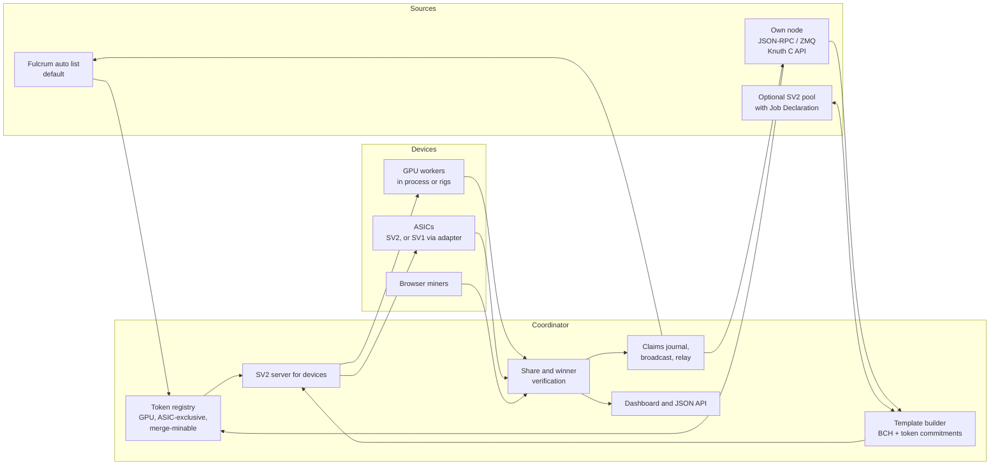

# Architecture and research

Where Pickaxe is going beyond the GPU miner, how the parts fit together, and
what already exists in the Bitcoin Cash mining ecosystem. The decided order is
in [next-steps.md](next-steps.md); the BCH Stratum V2 server from step 1 is
documented in [stratum-v2.md](stratum-v2.md), with its evidence in
[implementation-status.md](implementation-status.md). Research dates are the
day each fact was checked.

## What Pickaxe ships today

- GPU engines: CUDA for NVIDIA, native HIP for AMD Radeon RX 6000, 7000 and
  9000, and the portable wgpu engine (Vulkan, optional DirectX 12, Metal and
  the browser miner's WebGPU). See [gpu-sources.md](gpu-sources.md).
- Every GPU of a machine mines in one process: one job, one claim path, a job
  mailbox and restart with backoff per GPU, so a stuck GPU never blocks the
  others.
- PHOTON, the covenant token GPUs grind: jobs come from the automatic Fulcrum
  server list or the miner's own servers; claims are journaled, broadcast
  first and relayed to further servers; successor-baton mining keeps the GPUs
  busy between claims.
- Own node: BCHN-style JSON-RPC with failover between configured nodes,
  `getblocktemplatelight` with classic `getblocktemplate` as fallback,
  `submitblock` and `sendrawtransaction`. Servers and nodes are saved once per
  network.
- BCH ASIC mining (step 1, PR #38): a Stratum V2 server on the reference Rust
  crates, an SV1 adapter for SV1 firmware, full templates from the miner's
  BCHN node, a durable block journal, per-device vardiff, a workers table with
  each device's own report, and an adjustable donation. Tested on Chipnet with
  an Avalon Nano 3.
- GPU farms (PR #32): rigs on other machines mine as one with a coordinator,
  with backup coordinators and `--rigs-only` for a coordinator without GPUs,
  in the default build; live on Chipnet with two rigs on one PC, 349 claims in
  10 minutes. A public GPU pool, where each rig mines for its own address and
  the operator's fee is a share of mining time; the token donation in Advanced
  settings; the OpenCL engine for GPUs the other engines cannot drive; the
  portable engine on older Intel Vulkan drivers (wgpu's upstream fix), its
  self-test on T2 engines, and throttled mining at full batch sizes.
- In review (PR #40): a read-only `watch` view for a server running as a
  service, calmer vardiff, a setup that starts with GPU mining, ASIC mining or
  Run a pool, device reports and confirmed controls for every make through
  asic-rs (with Pickaxe's own CGMiner and Bitaxe code as the extension), and:
  - pool mode, where SV1 devices mine at a remote Stratum V2 pool through the
    adapter with no node, and the donation is mining time on a second channel;
  - a public ASIC pool that pays each miner at their own address in the
    coinbase, with an operator fee from the coinbase, the mining work or both,
    to a q or p (multisig) address;
  - finding a BCH node on the same computer (its cookie login), and moving to
    the next configured node when one stops answering;
  - Connection info: the stratum addresses devices and rigs use, for the local
    network and Tailscale, ready to copy, and joining an SV2 pool by its
    one-line `stratum2+tcp://HOST:PORT/KEY`;
  - PHOTON jobs from the miner's own BCH node when one is configured (Fulcrum
    as the fallback), live on a pruned Chipnet BCHN with no transaction index;
    after a fall back to Fulcrum, mining goes back to the node by itself once
    it answers again (#42), and the dashboard names the source;
  - Run a pool for GPUs (the public GPU pool, live with two rigs on Chipnet)
    and joining a GPU pool or farm from the setup;
  - workers named by their owners (never by an address), and a pool's name
    written into the blocks it finds.

## Product direction

- Solo miners first: one person's devices, from one machine to farms of many
  machines, mine as one and never compete with each other.
- GPU mode mines covenant tokens that GPUs grind (PHOTON today), natively and
  in the browser.
- ASIC mode offers two choices: an ASIC-exclusive token (SAFA-style), or BCH
  plus every merge-minable SHA-256 token at once.
- Where hashes go: P2Pool is a first-class destination and the intended
  default, then Stratum V2 pools and solo mining, with failover between them.
  The model is Gupax (and Gupaxx) for Monero, which bundles P2Pool with the
  miner and keeps lists of nodes it pings, picks from and fails over between.
  See [Mining destinations](#mining-destinations).
- Node connection: the automatic Fulcrum list stays the default, since many
  miners will not run a node; using one's own node becomes a guided step.
- Chipnet and mainnet are one code path with a network switch. Network
  differences live in data (deployments, ports, address prefixes, server
  lists); new work is tested on Chipnet first.

## Architecture

- One coordinator per miner is the only process that talks to the chain. It
  holds the payout addresses, journals and broadcasts claims and blocks, and
  serves the dashboard. Rigs and ASICs connect to it over Stratum V2 (Noise).
- Job sources: the Fulcrum list for covenant tokens (default), the miner's own
  node for block templates and broadcasts (required for BCH and merge mining
  unless a pool is used), and an optional pool.
- Devices get disjoint work without nonce bookkeeping: GPU workers sign with
  their own keys (covenant tokens); ASIC jobs get distinct extranonces or, for
  header-only jobs, distinct payout or commitment fields.

## Mining destinations

Decided on 2026-10-08. Pickaxe is software miners run, like Gupaxx for
Monero, not a hosted service; pool operators may run it too.

- **Stratum V2 only toward pools and P2Pool nodes.** Pools can be replaced,
  ASICs cannot: SV1 stays only between Pickaxe and firmware that needs it
  (the SV1 adapter), never toward a pool.
- **Job Declaration in both modes**, Full-Template and Coinbase-only, while
  pools are in transition, keeping BCH's canonical transaction order.
- **Default: the most decentralized option available.** Once a BCH P2Pool
  exists, Pickaxe runs its share chain in the background and uses the miner's
  own node as soon as it is entered. Until then: solo on the miner's own node.

| Destination | Builds the block | Holds the reward | Own node |
|---|---|---|---|
| Local P2Pool share chain (future default) | The miner | Coinbase, per the share chain | Yes |
| Public P2Pool node over SV2 | That node | Coinbase, per the share chain | No |
| Public P2Pool node with the miner's template | The miner | Coinbase, per the share chain | Yes; needs Job Declaration plus a payout-distribution extension |
| SV2 pool | The pool | The pool (custodial) | No |
| SV2 pool with Job Declaration | The miner | The pool (custodial) | Yes |
| Solo on the miner's own node (implemented, #38) | The miner | Coinbase, all of it | Yes |
| SV2 solo pool (for BCH: SoloFury) | The pool | Coinbase, minus the pool's fee | No |

Failover runs across these, for example the miner's own share chain, a public
P2Pool node, a solo pool, then a pool.

Job Declaration lets the miner choose the transactions, but the pool still
sets the coinbase outputs, with its own payout output first
(`AllocateMiningJobToken.Success.coinbase_tx_outputs`). Non-custodial pool
payouts need the coinbase payouts extension (sv2-spec #203, open).
DATUM-style designs, where an operator sets the coinbase outputs and holds
small balances, are not adopted.

### P2Pool for BCH (separate project)

A Bitcoin Cash port of P2Poolv2 is planned as its own project in
[CyberAshven/p2poolv2](https://github.com/CyberAshven/p2poolv2/pull/1)
(`docs/bch-plan.md`). It is not in Pickaxe's current scope; Pickaxe prepares
to plug it in:

- Stratum V2 is the boundary: the P2Pool node acts as an SV2 pool and job
  declarator; Pickaxe connects the devices and the miner's node, and starts
  the P2Pool node in the background.
- Payouts go directly into each block's coinbase (a PPLNS window, no ledger,
  no custody): visible at once and spendable after 100 blocks. A miner who
  stops keeps earning while their shares are in the window, and each share is
  worth far more than dust.
- A main and a "mini" share chain, as Monero's P2Pool has, keep small miners'
  waits short; Pickaxe can pick one from the miner's hash rate. Pickaxe's own
  vardiff shares stay local statistics; only shares at the share chain's
  difficulty enter the window.
- Merge mining: one coinbase commitment output covers every token a miner
  chose, so Pickaxe can let miners pick their tokens.

## Research findings

### Stratum V2

- Three sub-protocols: the Mining Protocol (device to upstream), Job
  Declaration (a miner declares its own template to a pool) and Template
  Distribution (a template provider, normally a node, to the job declarator).
  Binary and Noise-encrypted.
- Channels: standard (header-only; the upstream sends the merkle root),
  extended (the device builds the coinbase with an extranonce) and group
  channels. A translator lets SV1-only firmware join.
- Reference implementation (SRI, Rust): the protocol, codec, Noise and channel
  crates in `stratum-mining/stratum`, and the pool, job declarator and
  translator applications in `stratum-mining/sv2-apps`. Start9 packages SV2
  pool, solo and Job Declaration services for StartOS.

### Stratum V2 on BCH (checked 2026-10-05)

- bchn-sv2-bridge (LoneStrike Labs, AGPL-3.0, Python standard library only):
  an SV2 Template Distribution server for unmodified BCHN over JSON-RPC.
  BCH specifics: with canonical transaction order (CTOR) every refresh is a
  full template, never incremental; no segwit or witness commitment;
  templates sized to BCH's adaptive block size limit; a local proof-of-work
  check before `submitblock`. Tested on mainnet. Job Declaration is disabled
  on purpose: declaring jobs without canonical order produces invalid blocks.
- LoneStrike's BCH apps for Umbrel: SRI's pool patched for BCH (a zero vardiff
  floor and a tunable extranonce2), a Rust shim that terminates the pool's
  Noise link and forwards template frames to the bridge, BCHN, Fulcrum, and a
  BCH solo pool built on ASICseer pool.
- Knuth is adding Stratum V2 Template Distribution inside the node: framing,
  primitives, the template messages and connection setup were merged in July
  2026 (#534, #535, #537, #539, #540), on a mining job store moved out of the
  RPC layer (#532) and a configurable coinbase reserve (#530). Its JSON-RPC
  mining calls are `getblocktemplatelight`, `submitblocklight` and
  `getmininginfo`, backed by its C API. Interoperability with Pickaxe is not
  tested yet.
- ckpool supports Stratum V2 for pool and solo servers and for proxy
  upstreams, with a Job Declaration server; Bitcoin only. The BCH ckpool forks
  ASICseer pool and EloPool had not adopted it when checked.
- CashStratum (GPL-3.0, github.com/cashstratum/cashstratum; 1.2.1 on
  2026-10-06) is skaisser's BCH ckpool fork under a new name. Its C engine
  has its own Stratum V2 code (Noise, codec, mining and Job Declaration
  sources); its installers serve SV1 and leave SV2 off. Its server
  certificate uses format version 1, which the SV2 spec forbids (it must be
  0) and SRI-based clients refuse (checked 2026-10-08; reported as
  cashstratum/cashstratum#3).
- SoloFury runs Stratum V2 for BCH solo mining: extended channels only, no
  Job Declaration, CashAddr identities (`address.worker`) and a target per
  block from ASERT. Its BCH pool credits skaisser/ckpool, now CashStratum,
  and its BCH Stratum V2 certificate has CashStratum's version 1, so
  Pickaxe's pool mode refuses it until that is fixed. SoloFury's Bitcoin
  Stratum V2 runs on another stack, and Pickaxe's pool mode receives work
  from it (read-only check, 2026-10-08).
- The official Stratum V2 UI app for Umbrel is a setup wizard and dashboard
  for pool, solo and Job Declaration mining with the user's own node, running
  SRI's translator for SV1 miners; Bitcoin only. It is a model for Pickaxe's
  setup screens.
- Bitaxe firmware (ESP-Miner) has a native Stratum V2 client.
- BCHN has no Stratum V2 merge requests or issues; it gets Stratum V2 through
  external bridges.

What this means for Pickaxe, and what step 1 did:

- Do not re-implement Stratum V2: Pickaxe uses the SRI Rust crates for Noise,
  framing, messages and vardiff, with its own BCH work on top.
- Template sources: Pickaxe's own JSON-RPC client for stock BCHN (full
  templates first; `getblocktemplatelight` next), then Knuth's in-node
  template provider or its C API.
- CTOR: full templates only, and any Job Declaration client must keep
  canonical transaction order.
- Merge mining needs coinbase room for token commitments; Template
  Distribution's coinbase output constraints declare it, and Knuth's coinbase
  reserve sizes it.
- Devices: Bitaxe speaks Stratum V2 natively; most other firmware speaks SV1
  and connects through Pickaxe's adapter.

### Non-custodial payouts

- sv2-spec PR #203 (open) proposes a coinbase payouts extension:
  `SetPayoutDistribution` and a distribution ID on declared jobs, for non-debt
  accounting (PPLNS, SLICE, TIDES); validation recomputes the expected coinbase
  outputs and rejects mismatches. It suits BCH, whose large blocks carry many
  coinbase outputs.

### BCH pools and P2Pool

- ASICseer pool: a multithreaded C ckpool fork for BCH with pool and solo
  modes, using BCHN's `getblocktemplatelight`.
- EloPool: a ckpool fork focused on BCH.
- P2Pool for BCH: jtoomim's P2Pool supports BCH (CashAddr, port 9348), and the
  BitcoinCash1 organization keeps `p2poolBCH`. Current BCH sharechain activity
  has not been checked.
- The BitcoinCash1 organization packages BCH infrastructure for StartOS:
  ASICseer pool, EloPool, Knuth, Flowee the Hub, bchd, Fulcrum and an explorer.
- P2Poolv2 (Bitcoin, Rust, MIT/Apache-2.0): a DAG share chain with uncles and
  PPLNS payouts from the coinbase; its own stratum server is SV1 today, with
  CKPool's vardiff and share interval (about one share per 3.3 s). A BCH port
  needs segwit removed and a new share address format (it uses Taproot keys).
- sv2-p2pool (checked 2026-10-08): a Stratum V2 pool built from sv2-apps with
  P2Poolv2's share chain as its backend; full Job Declaration; "usable on
  testnet4"; Bitcoin only; AGPL-3.0.
- Monero's P2Pool: 10-second share chain blocks, a PPLNS window of 2,160 of
  them (about 6 hours), main, mini and nano share chains, and uncles; Gupaxx
  bundles it with the miner.

### Pools with Stratum V2 today (checked 2026-10-08)

- Bitcoin: Braiins Pool and DEMAND run Stratum V2 in production; DEMAND is
  built around Job Declaration and mined the first Job Declaration block.
  Foundry, AntPool, F2Pool and others joined the Stratum V2 working group in
  May 2026. ckpool supports Stratum V2 for pool, solo and proxy use with a
  Job Declaration server. OCEAN uses its own DATUM protocol instead: miners
  build templates and are paid in the coinbase.
- BCH: SoloFury has served Stratum V2 since August 2026, for BCH since
  September 2026; the large BCH pools, such as ViaBTC, publish SV1
  endpoints.

### Nodes and interfaces

- BCHN: JSON-RPC `getblocktemplate`, and `getblocktemplatelight` with
  `submitblocklight`, which are job-ID based: transaction data never reaches
  the miner and the node rebuilds the block.
- Knuth: a C++ node with a stable C API and bindings (C, C++, JavaScript and
  TypeScript, WebAssembly, C#, Python), usable in-process as a library, with
  optional JSON-RPC since 1.3.0. Supporting its native interface keeps Pickaxe
  from being limited to JSON-RPC.
- Flowee the Hub (binary API) and bchd (Go, gRPC) are further candidates.
- Local JSON-RPC is itself inter-process communication, so these notes name
  the interface (JSON-RPC, Knuth's C API, Cap'n Proto) rather than "IPC".

### ASIC-minable tokens on BCH

- SAFA (proposal, September 2026): a SHA-256 ASIC-minable token with an
  automated market. The ASIC hashes an 80-byte NFT commitment shaped like a
  block header: version (4), previous commitment hash (32), payout locking
  bytecode hash (32), timestamp (4), target (4) and nonce (4). A win is a
  HASH256 below the target, with
  `NextTarget = PrevTarget * (5000 * age / 71 + 5000) / 10000`. No deployment
  yet.
- Block Tops (BTOP): an earlier minable CashToken proposal.

### Merge mining tokens with BCH

- No BCH token merge mining exists yet. The precedent is AuxPoW (Namecoin with
  Bitcoin). For a covenant token it means verifying a BCH header and a
  coinbase merkle branch in script.

## ASIC mode design

### ASIC-exclusive token (SAFA-style)

- The coordinator builds 80-byte header-shaped jobs: the previous commitment
  hash in the previous-hash slot, the payout hash in the merkle-root slot,
  target and time.
- Standard (header-only) channels fit naturally: the upstream sends the merkle
  root and the device hashes the header as given.
- SV1 firmware builds the merkle root from a coinbase and extranonces, which
  cannot produce a fixed payout hash, so how SV1 ASICs would mine such a token
  is an open question.
- Claims are covenant transactions built by the coordinator, as for PHOTON.

### BCH plus every merge-minable token

- Templates come from the miner's own node, and the coinbase carries a
  commitment to every registered merge-minable token's current job.
- Each share is checked against the BCH target and every token's target: a BCH
  block goes to `submitblock`; a token-qualifying share becomes that token's
  claim transaction carrying the header, the coinbase and its merkle branch.
- This needs a merge-minable covenant standard designed with token authors,
  and a proof that it fits within BCH's VM limits, as
  `tools/reward-policy-vm` did for PHOTON's layouts.

## Own-node setup

- The automatic Fulcrum list stays the default: zero setup.
- "Use my own node" becomes a guided step: detect local nodes on standard
  ports, read cookie authentication from default data directories, test the
  connection, and show node name, version, network and sync height; warn when
  the node is behind or on the wrong network.
- When the node stops answering, keep mining from the Fulcrum list, show it on
  the dashboard, and switch back when the node returns (done in #42).
- The setup's BCH node list checks every saved node when it opens (and after
  a node is saved), each on its own thread, and says what it found: the
  client and sync height and whether it follows PHOTON, a refused login, no
  answer, another network or chain, or a node that answers but cannot follow
  PHOTON (no gettxout, such as Knuth), whose BCH ASIC templates still work
  (done in #42). A node without getnetworkinfo is "BCH node".
- The setup also searches this computer when a list opens: a node on
  another usual port (such as Knuth's 8332 on Chipnet), Fulcrum servers
  over TCP, WS or WSS (with their version and height) and ZMQ block notices,
  at most ten ports, each tried once with a short timeout. A node on this
  computer logs in with BCHN's bitcoin.conf (its rpcport and rpcuser and
  rpcpassword, or that network's cookie), read for each call and never kept
  (done in #42).
- A node's chain is proven by its fork block (BCH's UAHF block 478,559 on
  mainnet, Chipnet's block 115,252), since a Bitcoin (BTC) node reports the
  same chain name and testnet4 shares Chipnet's genesis: the ASIC server and
  GPU mining's return to the node refuse a BTC or testnet4 node (done in #42).
- A home Fulcrum server (Umbrel, StartOS) is taken over plain TCP,
  `tcp://HOST:PORT` such as `tcp://umbrel.local:50001`, on this computer or
  the home network only (done in #42); servers on the internet need `wss://`,
  since plain TCP could be impersonated to feed a false baton.
- ASIC BCH and merge mining need a node (or a pool), and setup says so only in
  that mode.

## Phases

1. BCH Stratum V2, so a miner points their ASIC at Pickaxe. Implemented in
   PR #38: SV2 firmware connects directly and SV1 firmware through the adapter,
   templates come from the miner's BCHN node, and the dashboard lists every
   device. Remaining items are tracked in
   [implementation-status.md](implementation-status.md).
2. GPU scaling: a coordinator and rigs on many machines, one job pushed to
   every rig, one claim path and one dashboard. Merged in PR #32: the
   coordinator is the normal miner with `--rigs-listen`, rigs follow it over
   the Stratum V2 Noise transport, and every rig winner is checked before the
   claim path rebuilds its transaction; live on Chipnet with two rigs on one
   PC. Rigs on separate machines remain to be tested.
3. The gaps, in an order to agree later: ASIC-exclusive tokens, the
   merge-minable token standard and the BCH-plus-tokens mode, the guided
   own-node setup, and the Stratum V2 pool and P2Pool connectors with Job
   Declaration and coinbase payouts (see
   [Mining destinations](#mining-destinations)). The BCH P2Pool itself is a
   separate project.

## Open questions

- Whether Bitaxe's Stratum V2 client opens standard (header-only) channels,
  which SAFA-style tokens need.
- When to start the merge-minable covenant design with token authors, and
  whether SAFA could align with it.
- Knuth: its C API in-process, or its RPC from a separate process.
- Which pools to list once any supports Stratum V2 Job Declaration for BCH.

## Sources and how they were checked

Checked on 2026-10-05 and 2026-10-08 by web search, by reading the pages and
specifications below, and through the GitHub API (repository, code, pull
request, issue and branch searches). Re-check anything marked open or pending
before relying on it.

Stratum V2:

- Specification: [protocol overview](https://stratumprotocol.org/specification/03-protocol-overview/),
  [Mining Protocol](https://stratumprotocol.org/specification/05-mining-protocol/),
  [Job Declaration](https://stratumprotocol.org/specification/06-job-declaration-protocol/).
- Reference implementation: https://github.com/stratum-mining/stratum ,
  applications https://github.com/stratum-mining/sv2-apps , Umbrel UI
  https://github.com/stratum-mining/sv2-ui .
- Coinbase payouts extension (open, updated 2026-09-15):
  https://github.com/stratum-mining/sv2-spec/pull/203 ; closed alternatives
  https://github.com/stratum-mining/sv2-spec/pull/202 and
  https://github.com/stratum-mining/sv2-spec/pull/195 .
- Start9 packages: https://github.com/Start9Labs/stratum-v2-startos ,
  https://github.com/Start9Labs/stratum-v2-pool-startos .
- ckpool (pool, solo, proxy and Job Declaration server):
  https://github.com/ckolivas/ckpool .
- Adoption: large pools joining the Stratum V2 working group (May 2026)
  https://news.bitcoin.com/bitcoin-mining-pool-giants-foundry-antpool-and-f2pool-signal-stratum-v2-shift/ ;
  DEMAND's first Stratum V2 block
  https://cryptobriefing.com/demand-pool-first-stratum-v2-block/ ; pools in
  production https://www.spark.money/research/bitcoin-stratum-v2-mining-decentralization ;
  support matrix https://d-central.tech/data/stratum-protocol-matrix/ .

Stratum V2 on BCH:

- bchn-sv2-bridge: https://github.com/danhaus93-ops/bchn-sv2-bridge ;
  LoneStrike BCH apps: https://github.com/danhaus93-ops/umbrel-bch-apps ;
  LoneStrike ckpool image: https://github.com/danhaus93-ops/lonestrike-ckpool .
- Knuth: https://github.com/k-nuth/kth (Stratum V2 from
  https://github.com/k-nuth/kth/pull/534 ; JSON-RPC:
  https://github.com/k-nuth/kth/blob/master/docs/json-rpc.md); package:
  https://github.com/BitcoinCash1/knuth-bch-startos ; site: https://kth.cash .
- SoloFury: https://solofury.com/blog/stratum-v2-bitcoin-cash-solo-mining/ ,
  https://solofury.com/blog/stratum-v2-solo-mining-guide/ , public docs
  https://github.com/solofurypool-code/solofury-public-docs (README: BCH pool
  on skaisser/ckpool).
- CashStratum: https://github.com/cashstratum/cashstratum (SV2 sources in
  `src/sv2_*.c`; certificate version in `src/sv2_noise.c`), certificate
  issue https://github.com/cashstratum/cashstratum/issues/3 ; SV2 spec on the
  certificate version:
  https://github.com/stratum-mining/sv2-spec/blob/main/04-Protocol-Security.md ;
  SRI's check: https://github.com/stratum-mining/stratum/commit/15e5969c8 .
- ViaBTC BCH (SV1 endpoints):
  https://support.viabtc.com/hc/en-us/articles/7207458561679-BCH-Mining .
- Bitaxe ESP-Miner: https://github.com/bitaxeorg/ESP-Miner .

P2Pool and decentralized pools:

- P2Poolv2: https://github.com/p2poolv2/p2poolv2 ; docs
  https://github.com/p2poolv2/docs (`compare_datum_sv2.adoc`, `stratum.adoc`).
- sv2-p2pool: https://github.com/average-gary/sv2-p2pool ; design notes
  https://github.com/average-gary/wiki/tree/main/topics/sv2-p2pool-integration .
- Braidpool: https://github.com/braidpool/braidpool .
- P2Pool v1: https://github.com/jtoomim/p2pool ; for BCH
  https://github.com/BitcoinCash1/p2poolBCH (from
  https://github.com/frstrtr/p2poolBCH).
- Monero P2Pool: https://github.com/SChernykh/p2pool ; Gupaxx:
  https://github.com/Cyrix126/gupaxx .
- https://p2pool.org/ ; Bitcoin Optech on pooled mining:
  https://bitcoinops.org/en/topics/pooled-mining/ .
- OCEAN DATUM: https://ocean.xyz/docs/datum ; explainers
  https://www.simplemining.io/insights/post/what-is-datum-bitcoin ,
  https://thebitcoinmanual.com/articles/datum/ .
- BCH P2Pool plan (separate project): https://github.com/CyberAshven/p2poolv2/pull/1 .

BCH pools, nodes and tokens:

- ASICseer pool: https://github.com/ASICseer/asicseer-pool ; BCHN
  `getblocktemplatelight`: https://gist.github.com/cculianu/89805c9cf525f314f46ea75e5b103d29 .
- BitcoinCash1: https://github.com/orgs/BitcoinCash1/repositories .
- SAFA: https://bitcoincashresearch.org/t/safas-a-sha256-asic-minable-automated-token-market/2123 ;
  BTOP: https://bitcoincashresearch.org/t/block-tops-btop-a-minable-cashtoken/1703 .

Searches used on 2026-10-08, to repeat or extend:

- Web: "P2Pool Stratum V2 decentralized pool 2026"; "Stratum V2 Job
  Declaration pool coinbase outputs miner template specification";
  "sv2-spec SetPayoutDistribution coinbase payouts extension pull request
  203"; "Bitcoin Cash BCH mining pool Stratum V2 support SoloFury ViaBTC
  2026"; "DEMAND pool Stratum V2 job declaration production Braiins pool SV2
  endpoint 2026"; "OCEAN DATUM protocol miner block templates coinbase
  payouts TIDES non-custodial".
- GitHub: code search `p2pool` + `sv2` (found sv2-p2pool); repository
  searches for `p2pool sv2`, `p2pool stratum v2` and `p2pool`; the p2poolv2
  organization's repositories, branches, commits, pull requests and issues
  for `sv2` and `stratum v2`; the sv2-spec pull requests for `payout`.
